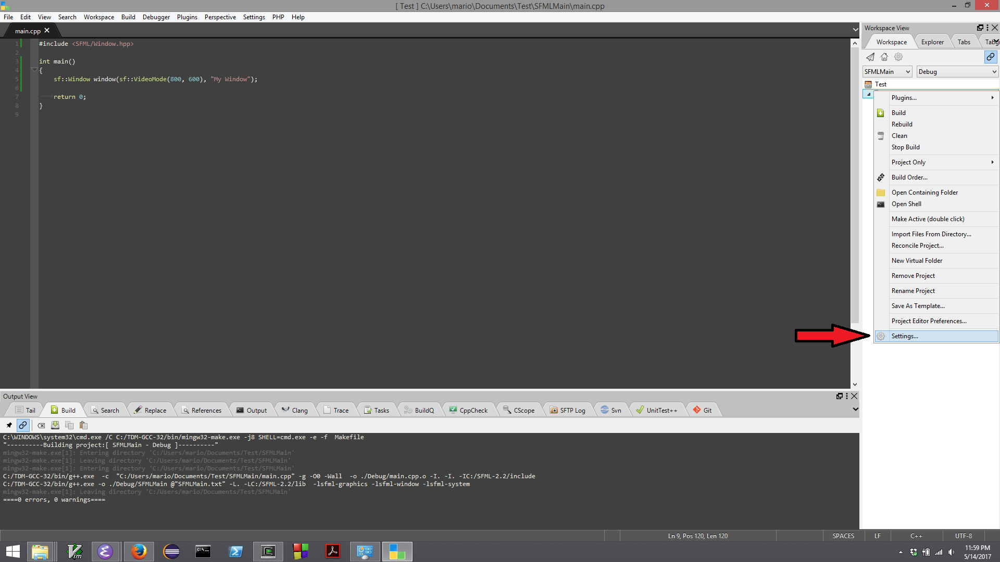
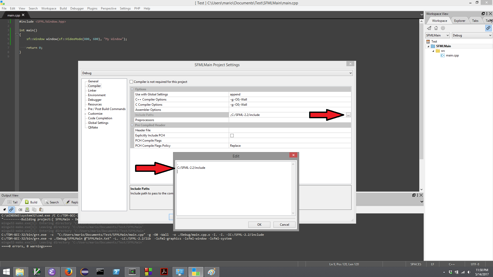
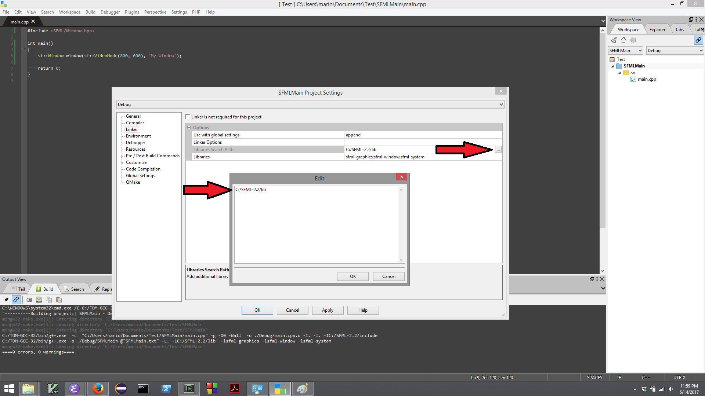
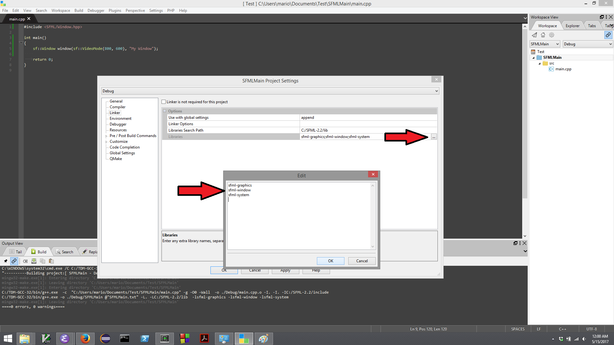
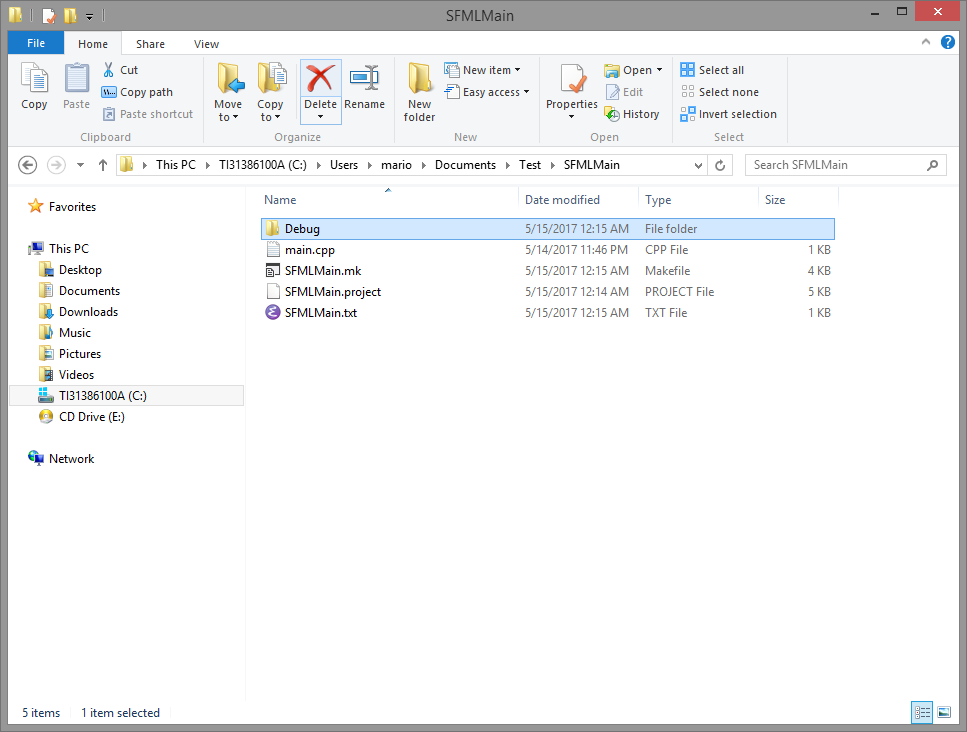

# Installing SFML

SFML is a collection of C++ classes and functions that will help us create applications with interactive
graphics and audio. It works on Windows, Linux and Mac, and it is easy to install and use.

## On Windows

Go to the [SFML download page](https://www.sfml-dev.org/download/sfml/2.2/) and select the right
version of SFML for your compiler. If you've followed the setup instructions so far, you should select
GCC 4.8.1 TDM (SJLJ) - 32-bit

After the download has finished, open the compressed file and extract the contents to a folder of your choice
(but make sure to remember where you put it!).

### Creating a SFML-enabled project

Open CodeLite and create a new project in your workspace (you can do this by clicking on New Project, from
the Workspace menu). Select the "Simple Executable (C++)" template for your project, and pick a project name.
Take good note of the project path!

Once you have created your project, open the Project Settings window

Select the "Compiler" tab and edit the "Include Paths" field. You should then write a line as in the picture,
with the directory where you unzipped the SFML folder plus `/include`.

Now, select the "Linker" tab and edit the "Libraries Search Path" field as in the picture, with the directory where
you unzipped the SFML folder plus `/lib`.

Finally, edit the "Libraries" field and add the entries `sfml-graphics`, `sfml-window` and `sfml-system`, as
in the picture.

Now you can start using SFML in your projects! However, when you try to run your code, you will
get an error pop-up. To fix this, navigate to the folder your project is located to and open the `Debug`
folder. You should see an executable file with the same name as your project. 

Now navigate to the folder where you unpacked SFML at the beginning and go to the `bin` folder. There you will
see a list of DLL files. Copy all of them to the `Debug` folder. Now your program should run fine!

## On Mac

Go to the [SFML download page](https://www.sfml-dev.org/download/sfml/2.2/) and download the Mac version of
SFML (there is only one option).

Copy the contents of the `include` folder to the path `/usr/local/include`, and the contents of the `lib` 
folder to `/usr/local/lib`. Then, copy the contents of the folder `extlib` to `/Library/Frameworks`.

That should be all!

## On Linux

Nobody has used Linux so far so I'll skip this.

